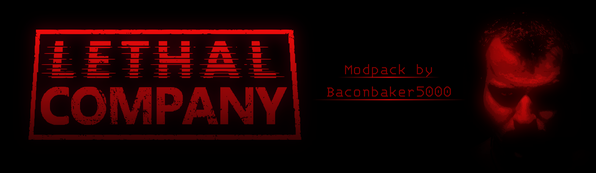

  

# Welcome to Jacek Company

This is a custom modpack for Lethal Company!

Download it here:  [**DOWNLOAD LINK**](https://baconbaker5000.github.io/JacekCompany/)

# Changelog
- Lots of new moons, all free!
- Lots of new enemies
- Tons more scraps
- You can fight with your fists by pressing J and using both mouse buttons
- Shotguns (and Shells) are buyable and on sale!
- Getting drunk makes you capable of great speeds
- The apparatus is twice as valuable and twice as dangerous
- No more gambling
- Emote by pressing C
- 9 pages of suits!

# Moons

Moon Info:

## Taiga
A Minecraft-themed moon.

Interiors:

40% - Woodland Mansion 
40% - Stronghold 
20% - End City 

## Aquatis

Interiors:

90% - The Subsystems 
10% - Castle 

## Black Mesa
A Half-Life themed moon.

Interiors:

100% - Black Mesa Facility 

## Bozoros
A colourful and bright moon.

Interiors:

95% - The Playzone™ 
5% - Circus 

## Atlas Abyss
A moon of dark secrets, jagged terrain and carved stone.

Interiors:

100% - Office 

## Orion
a moon with avast desert landscape.

Interiors:

80% - Tomb 
20% - Castle 

## Celest
A moon with a distinct red forest surrounding a vast valley.

Interiors:

100% - Liminal House 

## Acidir
A moon with a dark and deadly swamp.

Interiors:

100% - Gothic Manor 

## Tartarus
A Persona-themed moon.

Interiors:

100% - Tartarus Tower 

> [!IMPORTANT]
> Key information users need to know to achieve their goal.

TODO
make locker for sure spawn on one moon
fix up moon-interior weights
remove dogs
test multiplayers
